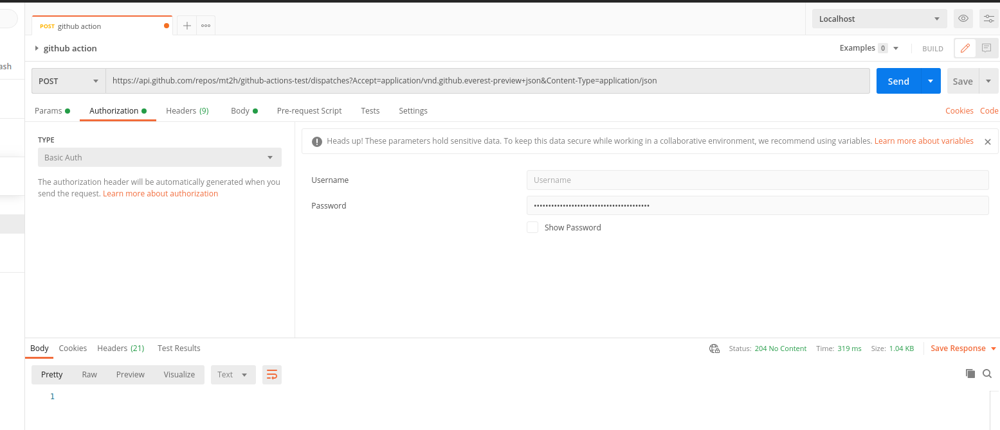
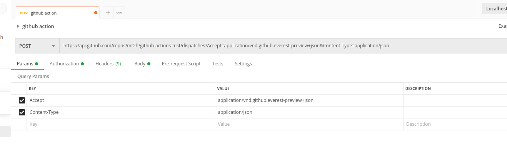
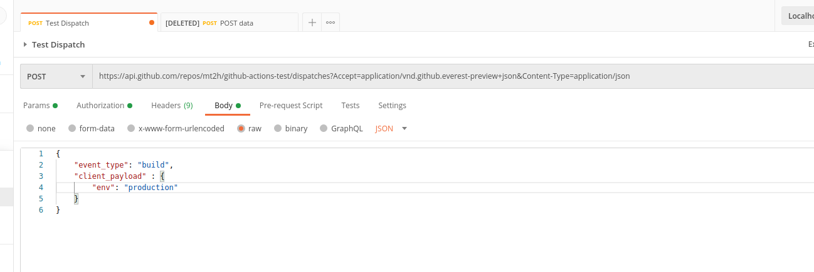
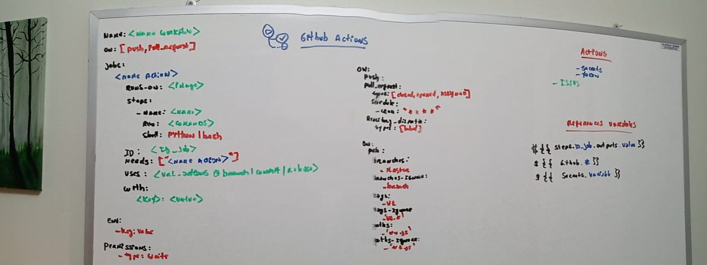

# GitHub Actions

## Commands GIT

```bash
#adding all files
git add -A
#create new branch
git checkout -b develop
#change branch
git checkout master
```

## On: Dispatch

Post Authorization


Post Parameters


Post JSON Data


## Board

