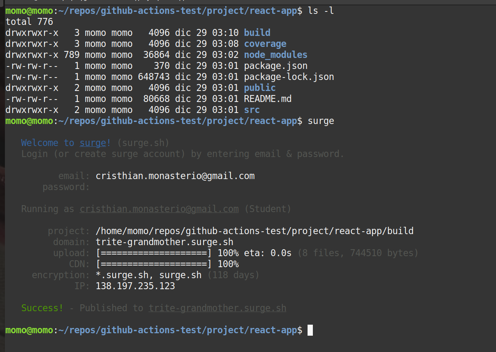

# GitHub Actions

## Commands GIT

```bash
#adding all files
git add -A
#create new branch
git checkout -b develop
#change branch
git checkout master
```

## Secrets

```bash
gpg --symmetric --cipher-algo AES256 secret.jso #1234
```

## On: Dispatch

Post Authorization


Post Parameters


Post JSON Data


## Project

```bash
#create react app
cd project/
sudo snap install node --classic
npx create-react-app react-app --use-npm

#local test
cd react-app/
npm run start

npm run test
CI=true #the npm run test doesn't heard changes
npm run test -- --coverage

npm run build

#deploy app on surge
sudo npm install --global surge
surge
#trite-grandmother.surge.sh
```

## Surge


## Board

